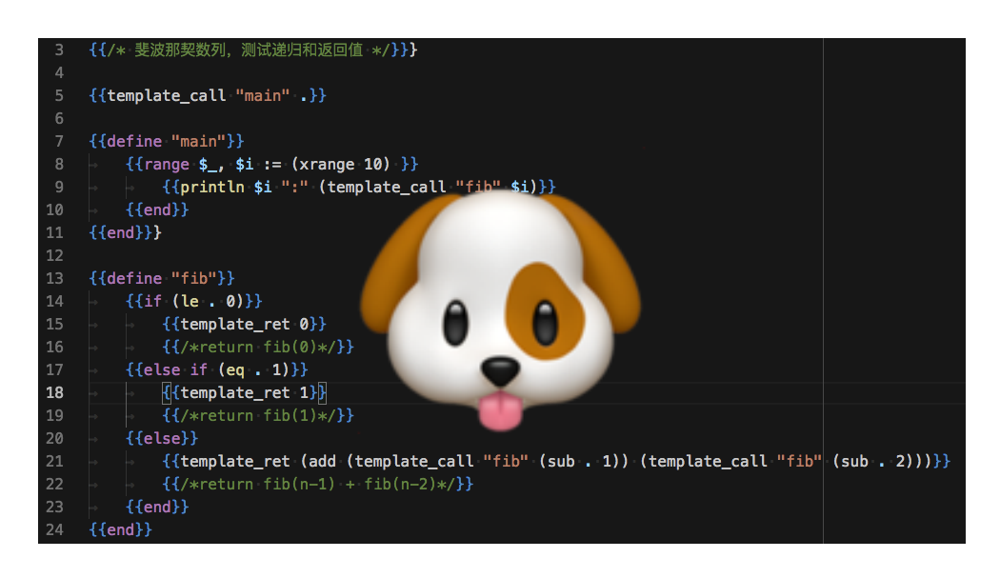

- *Go语言QQ群: 102319854, 1055927514*
- *KusonStack一站式可编程配置技术栈: https://github.com/KusionStack/kusion*
- *KCL配置编程语言: https://github.com/KusionStack/KCLVM*

----

# 狗头语言(Go Template Language)


狗头语言是“柴树杉(chai2010)”于2019年11月基于Go语言标准库`text/template`包定制的图灵完备的玩具语言。

## 安装

```
$ go get github.com/chai2010/gotlang/got
```

## 例子1：输出命令行参数

创建`hello.gotmpl`程序，输出命令行参数：

```gotmpl
{{/* 狗头语 版权 @2019 柴树杉 */}}}

{{template "main" .}}

{{define "main"}}
	{{range $i, $v := . }}
		{{println $i $v}}
	{{end}}
{{end}}
```

其中"{{}}"中间的是程序的语句，语句支持传统C语言风格的注释。然后通过`{{template "main" .}}`执行名字为"main"的模板，执行的参数是`.`表示的当前对象。这里的main模板可以看作是宏或者是函数，`template`指令会展开对应的宏函数，因此就产生了类似函数调用的效果（不过这个函数没有返回值）。然后通过`range`指令执行循环，每次循环打印相关信息。

运行脚本：

```
$ got hello.gotmpl aa bb cc
0 aa
1 bb
2 cc
```

执行时第一个参数是程序的路径，后面的参数是传递给狗头语脚本的命令行参数，也就是之前提到的`.`表示的当前对象。然后就可以输出命令行参数了。

## 例子2：打印斐波那契数列

创建`./examples/fib.gotmpl`程序，输出斐波那契数列：

```
{{/* 狗头语 版权 @2019 柴树杉 */}}}

{{template_call "main" .}}

{{define "main"}}
	{{range $_, $i := (xrange 10) }}
		{{printf "%d: %d\n" $i (template_call "fib" $i)}}
	{{end}}
{{end}}}

{{define "fib"}}
	{{if (le . 0)}}
		{{template_ret 0}}
		{{/*return fib(0)*/}}
	{{else if (eq . 1)}}
		{{template_ret 1}}
		{{/*return fib(1)*/}}
	{{else}}
		{{template_ret (add (template_call "fib" (sub . 1)) (template_call "fib" (sub . 2)))}}
		{{/*return fib(n-1) + fib(n-2)*/}}
	{{end}}
{{end}}
```

这个例子更为复杂：其中涉及到了通过递归函数计算斐波那契数列，然后将数列的前10个值打印出来。

运行脚本：

```
$ got ./examples/fib.gotmpl
0: 0
1: 1
2: 1
3: 2
4: 3
5: 5
6: 8
7: 13
8: 21
9: 34
```

## 语法高亮（VS Code）

安装 [gotemplate-syntax](https://marketplace.visualstudio.com/items?itemName=casualjim.gotemplate) 插件，效果如下：




## 版权

狗头语 版权 @2019 柴树杉。
